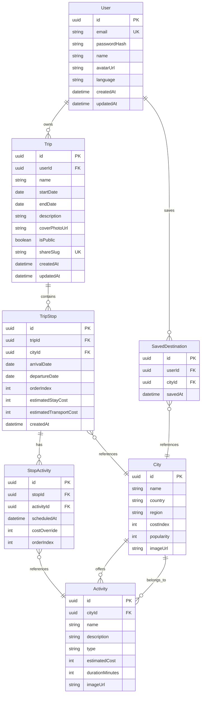

# Database Schema

PostgreSQL via Prisma. The schema file at `backend/prisma/schema.prisma` is the source of truth — this doc explains the design.

## Entity relationship diagram



## Tables

### users

| Column | Type | Notes |
|--------|------|-------|
| id | UUID | Primary key |
| email | VARCHAR | Unique, not null |
| password_hash | VARCHAR | bcrypt hash |
| name | VARCHAR | Display name |
| avatar_url | VARCHAR | Nullable |
| language | VARCHAR | Default `'en'` |
| created_at | TIMESTAMP | Auto |
| updated_at | TIMESTAMP | Auto |

### trips

| Column | Type | Notes |
|--------|------|-------|
| id | UUID | Primary key |
| user_id | UUID | FK → users |
| name | VARCHAR | Not null |
| start_date | DATE | Trip start |
| end_date | DATE | Trip end |
| description | TEXT | Nullable |
| cover_photo_url | VARCHAR | Nullable |
| is_public | BOOLEAN | Default false |
| share_slug | VARCHAR | Unique, nullable until shared |
| created_at | TIMESTAMP | Auto |
| updated_at | TIMESTAMP | Auto |

**Indexes:** `user_id`, `share_slug` (unique)

### trip_stops

| Column | Type | Notes |
|--------|------|-------|
| id | UUID | Primary key |
| trip_id | UUID | FK → trips |
| city_id | UUID | FK → cities |
| arrival_date | DATE | Must fall within trip dates |
| departure_date | DATE | Must be >= arrival_date |
| order_index | INT | Sort order (0-based) |
| estimated_stay_cost | INT | USD per night × nights (computed on save) |
| estimated_transport_cost | INT | USD, user-entered or default |
| created_at | TIMESTAMP | Auto |

**Indexes:** `trip_id`, `(trip_id, order_index)`

### cities (seed/reference)

| Column | Type | Notes |
|--------|------|-------|
| id | UUID | Primary key |
| name | VARCHAR | e.g. "Paris" |
| country | VARCHAR | e.g. "France" |
| region | VARCHAR | e.g. "Europe" |
| cost_index | INT | 1–10 relative expense |
| popularity | INT | For sorting recommendations |
| image_url | VARCHAR | Nullable |

### activities (seed/reference)

| Column | Type | Notes |
|--------|------|-------|
| id | UUID | Primary key |
| city_id | UUID | FK → cities |
| name | VARCHAR | |
| description | TEXT | |
| type | VARCHAR | sightseeing, food, adventure, culture, nightlife |
| estimated_cost | INT | USD |
| duration_minutes | INT | |
| image_url | VARCHAR | Nullable |

**Indexes:** `city_id`, `type`

### stop_activities

| Column | Type | Notes |
|--------|------|-------|
| id | UUID | Primary key |
| stop_id | UUID | FK → trip_stops |
| activity_id | UUID | FK → activities |
| scheduled_at | TIMESTAMP | Nullable — specific day/time |
| cost_override | INT | Nullable — overrides activity.estimated_cost |
| order_index | INT | Sort within stop/day |

**Indexes:** `stop_id`

### saved_destinations

| Column | Type | Notes |
|--------|------|-------|
| id | UUID | Primary key |
| user_id | UUID | FK → users |
| city_id | UUID | FK → cities |
| saved_at | TIMESTAMP | Auto |

**Unique constraint:** `(user_id, city_id)`

## Budget calculation (computed, not stored)

Budget is calculated on read, not stored in a separate table:

```
total = sum(stop.estimatedTransportCost)
      + sum(stop.estimatedStayCost)
      + sum(stopActivity.effectiveCost)
      + estimatedMealsPerDay × tripDays

effectiveCost = stopActivity.costOverride ?? activity.estimatedCost
```

Categories:
- **Transport:** sum of `trip_stops.estimated_transport_cost`
- **Stay:** sum of `trip_stops.estimated_stay_cost`
- **Activities:** sum of effective activity costs
- **Meals:** `MEALS_PER_DAY_DEFAULT (e.g. $50) × number of trip days`

See [api/budget.md](./api/budget.md) for response shape.

## Seed data plan

Run via `npm run seed` in backend.

| Data | Count | Notes |
|------|-------|-------|
| Cities | 30–50 | Mix of popular destinations across regions |
| Activities | 5–10 per city | Varied types and costs |
| Demo user | 1 | `demo@globetrotter.com` / `password123` |
| Demo trip | 1 | Multi-city with stops and activities |

## Migration rules

1. Always change schema via `prisma/schema.prisma`
2. Run `npx prisma migrate dev --name <description>`
3. Never hand-edit the database — always use migrations
4. Update this doc if relationships change
