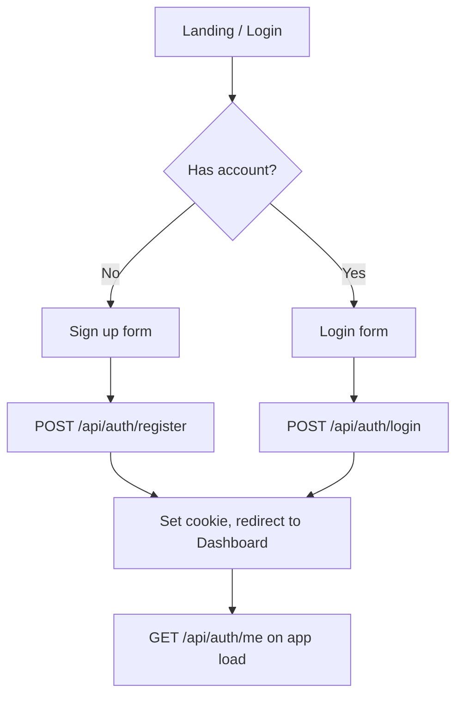
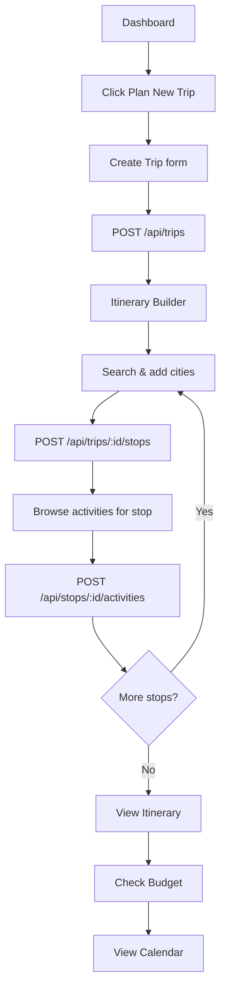
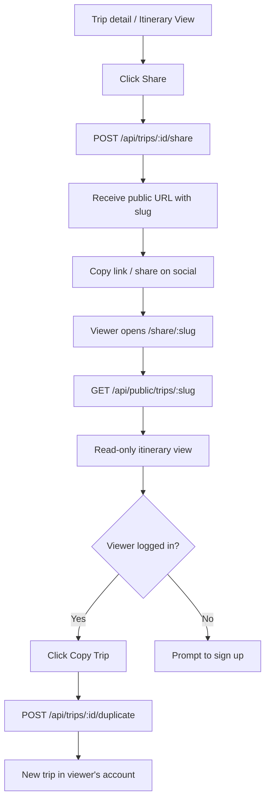

# User Flows

Visual flows for the main journeys through the app.

## Authentication

## Create and build a trip

## Share a trip

## Trip ownership and access

| Action | Required auth | Ownership check |
|--------|---------------|-----------------|
| Create trip | Yes | Auto-assigned to user |
| View own trip | Yes | `trip.userId === user.id` |
| Edit/delete trip | Yes | Owner only |
| View public trip | No | `trip.isPublic === true` |
| Copy public trip | Yes | Any public trip |

## Error paths

| Scenario | HTTP status | Code |
|----------|-------------|------|
| Not logged in | 401 | `UNAUTHORIZED` |
| Trip not found | 404 | `NOT_FOUND` |
| Trip belongs to another user | 403 | `FORBIDDEN` |
| Validation failure | 400 | `VALIDATION_ERROR` |
| Stop dates outside trip range | 400 | `INVALID_DATES` |
| Duplicate email on register | 409 | `EMAIL_EXISTS` |
